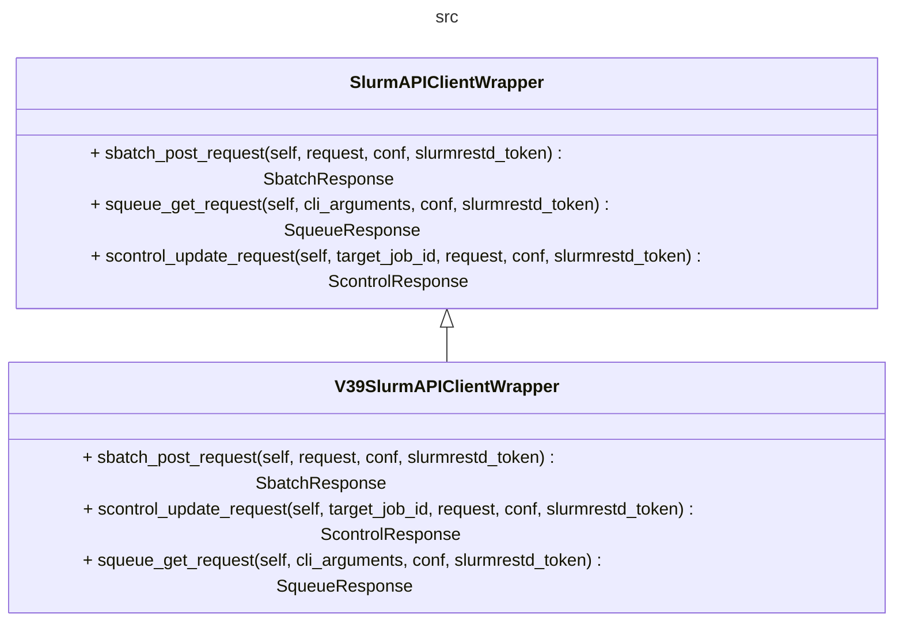

## Add support for a new command

There is no generalizable way of adding support to new command. Here is a general overview:

Find into the documentation (of the corresponding API) the resource that can be used for the request: https://github.com/SLURM-CLI-API-Proxy/SLURM-CLI-API-Proxy-client/tree/main/slurm_api_client

For example, for adding `sinfo`, the method would be GET /slurm/v0.0.39/partitions

1. Go to the given example: https://github.com/SLURM-CLI-API-Proxy/SLURM-CLI-API-Proxy-client/blob/main/slurm_api_client/docs/SlurmApi.md#slurm_v0039_get_nodes . Use the code snippet provided in the documentation to create a working client, and to explore how the payload must be created (see docs/reference_code_snippets). Use a test cluster, or start the containerized SLURM cluster (see start_dockerized_slurm) to this end.

2. Add a method on the SlurmAPIClientWrapper interface and the V39 implementation. Use the code snipped as the baseline. 

To have a consistent behavior, scale the exceptions as ApiClientException.

3. Create a type to encapsulate the request output. Include errors reported by the workload manager.

4. There are two types of errors: the request could fail (ApiClientException), which should make the program fail. The other error: the request has a 202 status, but the response includes an error reported by slurm. To report this error 

To see what the response to the request, for a GET request in particular look like, 

The resource used for sinfo: a list of nodes:

https://github.com/SLURM-CLI-API-Proxy/SLURM-CLI-API-Proxy-client/blob/main/slurm_api_client/docs/V0039PartitionsResponse.md

In general the method requires: cli_arguments:dict,conf:openapi_client.Configuration,slurmrestd_token:str)-> Response:

1. Create a class SinfoResponse(): to encapsulate the output.

2. Add a function on the slurm_api_cli_proxy.command_handler module.

5. client_args_linker.args_to_payload_mapper

Modify the SlurmAPIClientWrapper abstraction. Once it is complete enough, will be useful to provide support to different API versions.

For a POST/UPDATE command (with a payload), returns a dictionary with the same structure as the JSON object required by the request (e.g., based on the extra metadata provided in the YAML file).

For a GET command () -> a dictionary ready to be used to define how to present the output.

For a

Handler - 
    sbatch()

        args_to_request_payload(args): dict (to build the payload)

    squeue()
        args_to_squeue_parameters_dict (args): dict 

SBATCH (request:dict)

SQUEUE (cli_arguments:dict)

### Commands with a complex request setup, and a simple output pre-processing

sbatch, scontrol

### Commands with a simple request setup, and a complex output pre-processing

squeue, sinfo

## Support for multiple API versions

As previously discussed, the baseline design has this into consideration. A version selection mechanism should be define when the tool eventualy reach this point.

1. Generating an additional slurm_api_client, if the target version is not supported by the current one.
2. Creating a new client wrapper VXXSlurmAPIClientWrapper
3. Create the correspondign YAML files (these could be based on the existing ones)
4. Implement the methods accordingly

args_to_payload_mapper -> pre-process the dictionary given by argparse. 

