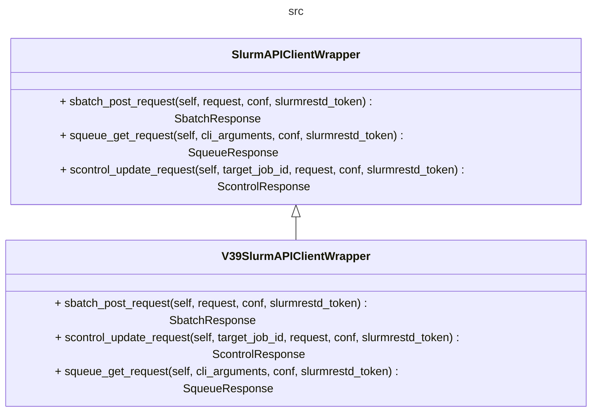
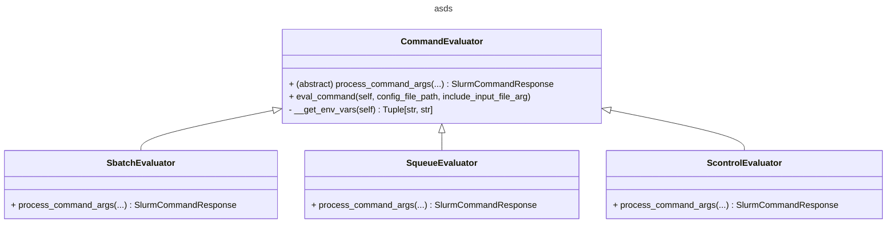

# Adding new commands

The current version of the tool provides proxies for the `sbatch`, `squeue` and `scontrol`, commands, with a selection of their respective arguments. In the process of inclusing these, there were further design considerations for simplyfing as much as possible the inclusion of additional SLURM commands. These design considerations, along with the suggested steps for adding a new command, are below described, with `sinfo` as a reference example.

1. As the first step, identify wich resources of the SLURM API can be used to replicate the new command. Using the examples included in the documentation, make experiments with the API client to understand what is required by the payload, the structure of the API response, etc. The `sinfo` requires performing GET requests to `/slurm/v0.0.39/partitions` and
`/slurm/v0.0.39/nodes` resources, hence you can refer to the [slurm_v0039_get_nodes](https://github.com/SLURM-CLI-API-Proxy/SLURM-CLI-API-Proxy-client/blob/main/slurm_api_client/docs/SlurmApi.md#slurm_v0039_get_nodes) and [slurm_v0039_get_partitions](https://github.com/SLURM-CLI-API-Proxy/SLURM-CLI-API-Proxy-client/blob/main/slurm_api_client/docs/SlurmApi.md#slurm_v0039_get_partitions) functions documentation. As you will see, the [V0039NodesResponse](https://github.com/SLURM-CLI-API-Proxy/SLURM-CLI-API-Proxy-client/blob/main/slurm_api_client/docs/V0039NodesResponse.md) provides details of every node, including the list of the partitions each one belongs to, whereas the[V0039PartitionsResponse](https://github.com/SLURM-CLI-API-Proxy/SLURM-CLI-API-Proxy-client/blob/main/slurm_api_client/docs/V0039PartitionsResponse.md) gives the detais of such partitions. Use these code examples to create a minimum python script that performs a request to these two resources and print the 'raw' output.

2. To run the script, update the *host* and *api_key* properties so that they match your target test SLURM server:

    ```python

    configuration = openapi_client.Configuration(
        host = "http://<slurm-controllers-name>:6820"
    )

    configuration.api_key['token'] = os.environ["SLURM_JWT"]

    ```

3. Create a new YAML file for the command on `src/mappings` (all the YAML files here are copied to the Python package data, as seen on the `setup.py` file). By convention, to ensure that a cli parser is properly created for the new command, each argument must include the *name*, *abbreviation*, *is_mandatory*, and *type* elements:

    ```yaml
    mapping_meta:
    command: sinfo
    api_version: 0.0.39
    wlm_release: 23.11
    wrapper_package: slurm_api_cli_proxy.client_args_linker.v39.slurm_api_client_wrapper_v39
    wrapper_class: V39SlurmAPIClientWrapper

    parameters:

    - name: 
        abbreviation: 
        is_mandatory: 
        
    ```

4. Add an abstract method to the *client wrapper* interface
   
   
5. V39SlurmAPIClientWrapper
   

(the implementation for v0.0.39)

def sinfo_get_request(self,cli_arguments:dict,conf:openapi_client.Configuration,slurmrestd_token:str)-> SinfoResponse:


5. the SlurmAPIClientWrapper interface and the V39 implementation. Use the code snipped as the baseline. 




To have a consistent behavior, scale the exceptions as ApiClientException.

1. Create a type to encapsulate the request output. Include errors reported by the workload manager.

2. There are two types of errors: the request could fail (ApiClientException), which should make the program fail. The other error: the request has a 202 status, but the response includes an error reported by slurm. To report this error 




Creating SinfoEvaluator class:


```python

class SinfoEvaluator(CommandEvaluator):

    def process_command_args(self,
      slurm_cli_wrapper:SlurmAPIClientWrapper,cli_args,
      command_mappings_config:CliToJsonPayloadMappings,
      configuration:openapi_client.Configuration,
      slurm_jwt:str)->SlurmCommandResponse:    

        #dictionary with the arguments/values given to the squeue command
        request_args = args_to_parameters_dict(command_args_dict=vars(cli_args))

        response = slurm_cli_wrapper.sinfo_get_request(request_args, 
        configuration,slurm_jwt)

        return response


```


Add the method to be used on the entry point
```python
    #setup.py
    ...
    entry_points={
        "console_scripts": [
            "sbatch=slurm_api_cli_proxy.command_handler:sbatch",
            "squeue=slurm_api_cli_proxy.command_handler:squeue",
            "scontrol=slurm_api_cli_proxy.command_handler:scontrol",
            "sinfo=slurm_api_cli_proxy.command_handler:sinfo",
        ],
    },

```
```
def sinfo():

    eval = SinfoEvaluator()
    eval.eval_command(config_file_path='mappings/sinfo_mappings_r23.11_v0.0.39.yaml')    

```


To see what the response to the request, for a GET request in particular look like, 

The resource used for sinfo: a list of nodes:

https://github.com/SLURM-CLI-API-Proxy/SLURM-CLI-API-Proxy-client/blob/main/slurm_api_client/docs/V0039PartitionsResponse.md


In general the method requires: cli_arguments:dict,conf:openapi_client.Configuration,slurmrestd_token:str)-> Response:


1. Create a class SinfoResponse(): to encapsulate the output.

2. Add a function on the slurm_api_cli_proxy.command_handler module.


5. client_args_linker.args_to_payload_mapper


Modify the SlurmAPIClientWrapper abstraction. Once it is complete enough, will be useful to provide support to different API versions.


For a POST/UPDATE command (with a payload), returns a dictionary with the same structure as the JSON object required by the request (e.g., based on the extra metadata provided in the YAML file).

For a GET command () -> a dictionary ready to be used to define how to present the output.

For a

Handler - 
    sbatch()


        args_to_request_payload(args): dict (to build the payload)


    squeue()
        args_to_squeue_parameters_dict (args): dict 


SBATCH (request:dict)

SQUEUE (cli_arguments:dict)


### Commands with a complex request setup, and a simple output pre-processing

sbatch, scontrol

### Commands with a simple request setup, and a complex output pre-processing

squeue, sinfo

## Support for multiple API versions

As previously discussed, the baseline design has this into consideration. A version selection mechanism should be define when the tool eventualy reach this point.

1. Generating an additional slurm_api_client, if the target version is not supported by the current one.
2. Creating a new client wrapper VXXSlurmAPIClientWrapper
3. Create the correspondign YAML files (these could be based on the existing ones)
4. Implement the methods accordingly


args_to_payload_mapper -> pre-process the dictionary given by argparse. 

