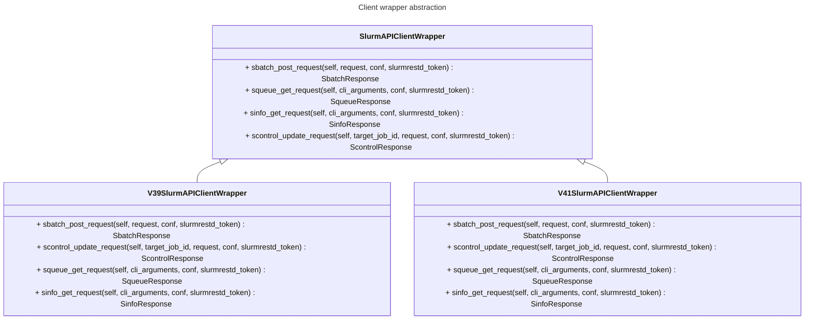

# Supporting alternative SLURM API versions

As described in the previous sections, this application's core is decoupled from any particular version of API client. All the implemented command handlers make reference to an abstract `SlurmAPIClientWrapper`, and the specific implementation to be used is defined at runtime depending on what's defined on the used YAML configuration files.

Given this, adding support for an alternative version of the SLURM API would require, in principle:

1. Creating a new class that implements the `SlurmAPIClientWrapper` interface.
2. Implementing all of its methods, which could be, for the most part, based on the existing implementations.
3. Redefining new YAML files for each command, changing the mappings according to the new API specifications, and changing the `wrapper_class` accordingly.

However, the scenario of adding support for new versions has not been explored in detail, and it may require further refinements on the tool design.