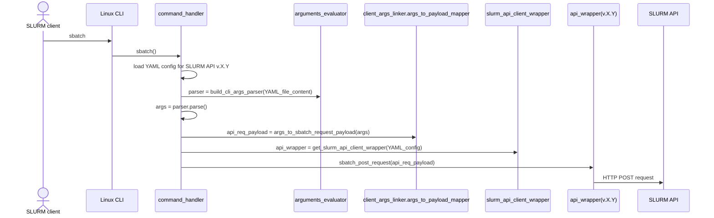
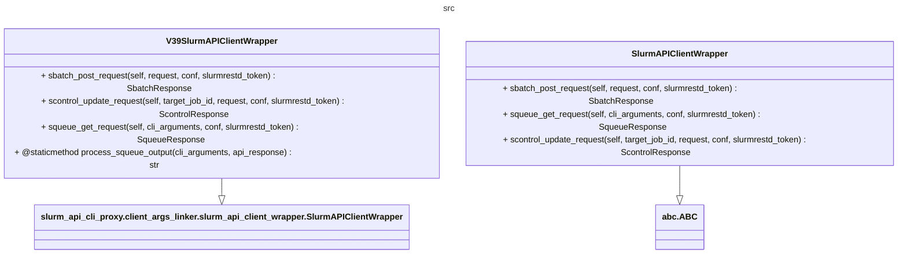
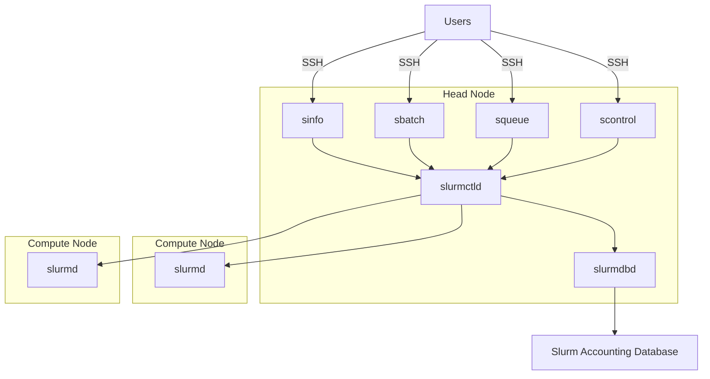
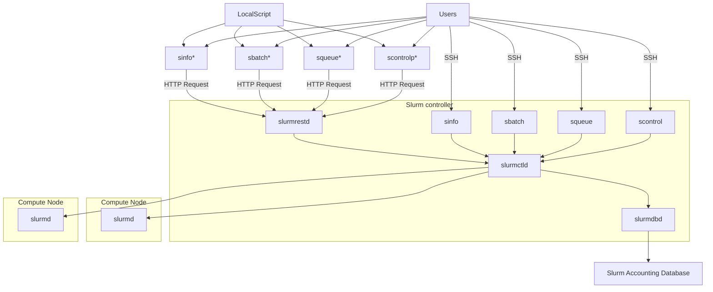

# Developer documentation

!!! warning "Under Development"
    
    This tool is under active development. The documentation is not complete yet. If you have any 
    questions, please contact us via [GitHub Issues](https://github.com/SLURM-CLI-API-Proxy/SLURM-CLI-API-Proxy-client/issues)

## Design drivers

The purpose of the SLURM-CLI proxy is to enable scripts or platforms 
that rely on SLURM commands for using HPC infrastructure, when such commands are not locally available (e.g., the platform can't be installed within the SLURM cluster, where the commands are available) but the REST API of the target SLURM cluster is enabled. However, given that each SLURM command has tens or even hundreds of arguments, but not all of them have a counterpart on the API, and most are not likely to be required by these platforms/scripts, this tool is not intended to be an exhaustive implementation. Instead, this tool provides a basic set of commands -with their related arguments- that can be extended as required.

To this end, the tool is implementad in a way that it generalizes how an API request is built and submited to an SLURM API endpoint. That is to say, it decouples the logic required for turning a given set of argument values into an API request from their specificities. Such specificties are defined on an external YAML file...

The commands handle the arguments in different ways. Sbatch -> POST request to /job resource: arguments used to create complex payload. The output requires no processing. Squeue -> GET to /jobs resource: no payload required, the arguments are used to format the response (no api_mapping).


### The YAML files define: 

#### sbatch

```yaml
  - name: --job-name
    # abbreviated argument (the same as 'name' if it doesn't have an abbreviation)
    abbreviation: -J
    # when 'true' makes the command fail if not set
    is_mandatory: false
    data_type: str
    api_mapping:
      # Defines on which property of the API request payload the argument value must be set.
      request_property: job.name
      # If the property value needs a pre-processing, a lambda expression can be included
      lambda_expression: "lambda p: p.split(',')"

```

#### squeue

- The argument name
- Argument type

Overall: 

1. The application parses the YAML file defined for the executed command.
2. The CLI interpreter is configured based on the commands defined on the YAML.
3. The arguments are parsed. If the input is correct, the arguments are used as follows:
   - sadas 





building an API request for a given command and a set of argument values, 

To illustrate how the tool can be extended to support additional arguments, it is important to consider its design principles:

- The proxy requires capturing 


To understand how new arguments can be added to a particular command, it is important t

To ease this extension process, the tool follows the open-closed principle, that is, 


When the tool is properly installed, the SLURM commands would be ready to use tho


- Slurm WLM has a reduced set of commands, but the number of optional arguments required by each one is significantly large
- The OpenAPI specification of slurmrest changes significantly on each new version, as well as the supported arguments by each wlm version.
- A wlm can provide support to multiple OpenAPI specification versions
- Each OpenApi specifaction may significantly differ from each other

Client:

https://github.com/SLURM-CLI-API-Proxy/SLURM-CLI-API-Proxy-client/blob/main/slurm_api_client/docs/SlurmApi.md


### References

- Schmed's [Slurm REST API documentation](https://slurm.schedmd.com/rest_api.html)
- Schmed's [Slurm command line documentation](https://slurm.schedmd.com/sbatch.html)
- [Slurm version vs supported API versions](https://slurm.schedmd.com/upgrades.html#openapi_changes)


sbatch: complex POST request, simple output

squeue: simple GET request, complex output










### open_api_client example
```python
--8<-- "docs/reference_code_snippets/sample_sbatch_v39.py"
```