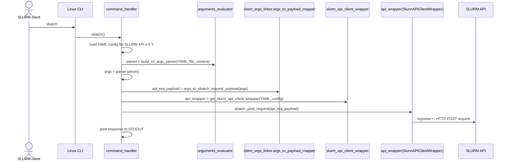
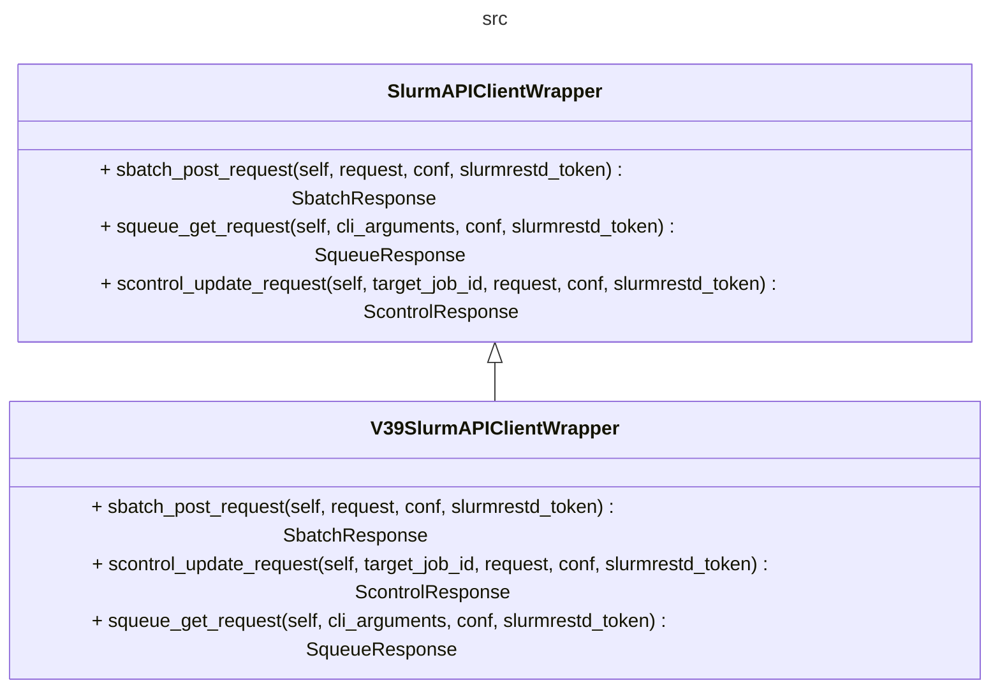
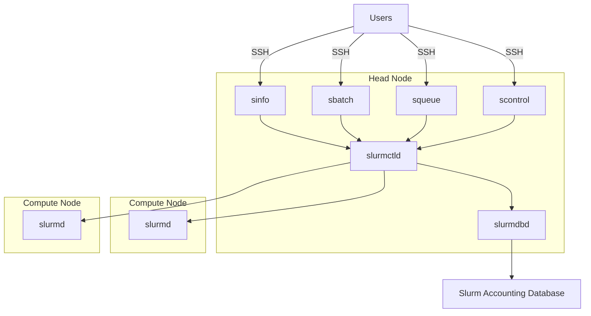
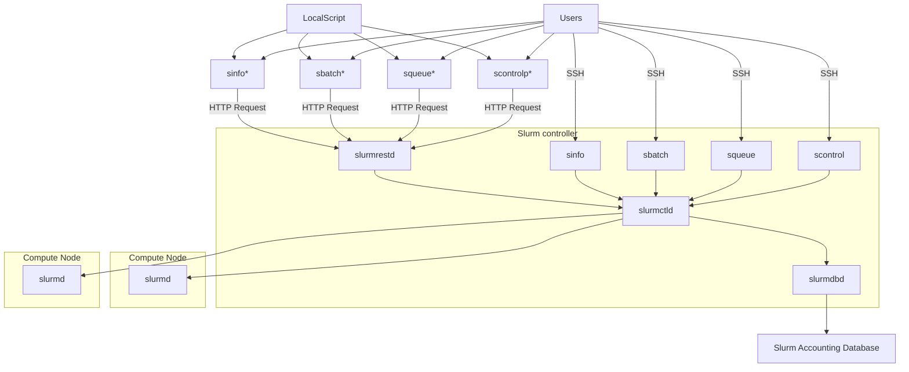

# Extending the SLURM CLI-API Proxy

## Tool core design

The purpose of the SLURM-CLI proxy is to enable scripts or platforms 
that rely on SLURM commands for using HPC infrastructure to do it when such commands are not locally available (e.g., the platform can't be installed within the SLURM cluster). To this end, this tool provides proxies of the SLURM commands which, under the hood, make use of the SLURM REST API. 

Given that each SLURM command has tens or even hundreds of arguments, but not all of them can be re-implemented through API calls -and are not likely to be required by these platforms/scripts- this tool is not intended to be an exhaustive implementation. Instead, the provided SLURM-command proxies provide a  subset of related arguments that can be extended as required.

To this end, this tool is designed in a way that it generalizes how a given set of argument values of a SLURM command are transformed into its corresponding API request. This way, the addition of support for new arguments only requries (1) adding an entry into a YAML configuration, defining the argument and how its value should be included within the API's request, and (2) adding a piece of code for pre-processing the API response. It is worth noting, however, that step (2) is only necesary for commands like `squeue` and `sinfo` whose arguments are mostly used for formatting the API response -so it resembles the original one-, not for the API request itself.

To illustrate this, let's ellaborate on what happens when the `sbatch` proxy command is executed:

1. The CLI parser (argparse) is dynamcally configured based on the arguments defined on the `sbatch` command's YAML configuration file(`mappings/sbatch_mappings_r23.11_v0.0.39.yaml`). As the file name implies, it is specific for a particular SLURM API version (in this case, v0.0.39, defined for the SLURM's workload manager -release 23.11 ). For example, the following entries on this config file adds support to the `--export` and `--job-name arguments`, for which a string values (`data_type: str`) are expected:

    ```yaml
    # mappings/sbatch_mappings_r23.11_v0.0.39.yaml

    - name: --job-name
    abbreviation: -J
    is_mandatory: false
    data_type: str
    api_mapping:
      request_property: job.name

    ```

2. The CLI parser is used (in addition to check the consistency of the command) to capture the values given to the arguments by the user.

3. The captured argument values are used to build the API request payload based on the specifications given on the YAML file (see the `api_mapping` elements). For example, when running the command:`sbatch script1.sh --job-name job123`, the following JSON object (which correspond to the [specification required by the SLURM v0.0.39 API client](https://github.com/SLURM-CLI-API-Proxy/SLURM-CLI-API-Proxy-client/blob/main/slurm_api_client/docs/V0039JobDescMsg.md)) is generated considering the given `api_mapping/request_property` values:

    ```json

    //Payload generated for the command: sbatch script1.sh --job-name job123

    {
        "script": "<the content of script1.sh>",  
        "job": {
            "name": "job123"
        }
    }
    ```

4. The request to the SLURM API is performed using a *client wrapper*, which is also defined in the sbatch's command YAML file (`wrapper_class`). This class encapsulates the logic required to perform the request, using the generated payload, to the specific SLURM API version (in this case, V0.0.39). This *client wrapper* uses, under the hood, the [the API client for the target API version](https://github.com/SLURM-CLI-API-Proxy/SLURM-CLI-API-Proxy-client/blob/main/slurm_api_client/docs/SlurmApi.md#slurm_v0039_submit_job).

    ```yaml

    # mappings/sbatch_mappings_r23.11_v0.0.39.yaml

    mapping_meta:
    command: sbatch
    api_version: 0.0.39
    wlm_release: 23.11
    wrapper_package: slurm_api_cli_proxy.client_args_linker.v39.slurm_api_client_wrapper_v39
    wrapper_class: V39SlurmAPIClientWrapper

    ...
    ```

5. The response to the HTTP request is pre-processed (e.g., handling HTTP error codes, error messages, etc), then printed to STDOUT, and a corresponding ERROR CODE is returned (e.g., 0 when command was successful).


The following sequence diagram describes the above with more specific module and classes references:




## Adding support to new arguments to an existing command

Given the design previously described, adding support to a new argument to a given command, already configured for a given API version (in this case, v0.0.39) involves the following steps:

1. Check which SLURM API resource is being used as the target for implement the command proxy. For example, the `sbatch` proxy command currently implemented performs a POST request to `/slurm/v0.0.39/job/submit`.
2. Check which property of the corresponding POST payload should be set to the value given to the argument. To this end, look at the documentation of the SLURM API Client that defines the structure of the request payload for the `job/submit` resource: [V0039JobDescMsg](https://github.com/SLURM-CLI-API-Proxy/SLURM-CLI-API-Proxy-client/blob/main/slurm_api_client/docs/V0039JobDescMsg.md). 
3. Based on the above, add an entry on the existing YAML configuration file of the `sbatch` command (`mappings/sbatch_mappings_r23.11_v0.0.39.yaml`). For example, on the above it can be seen that the value given to a `--chdir` argument, which defines in which directory -within the SLURM worker- the script will be executed, can be set on the API request by including the `current_working_directory` property:

    ```yaml
    - name: --chdir
    abbreviation: -D
    is_mandatory: false
    data_type: str
    api_mapping:
        request_property: job.current_working_directory
    ```

4. And that's it! However, if the captured argument value needs to be pre-processed, you can include a lambda expression to make transformations when needed. For example, the `--export` argument, in the `sbatch` command receives a string with comma-separated values. 

    By including the following definition on the `sbatch` YAML configuration file:

    ```yaml
    - name: --export
    abbreviation: --export
    is_mandatory: false
    data_type: str
    api_mapping:
        request_property: job.environment
        lambda_expression: "lambda p: p.split(',')"
    ```

    The following request payload would be generated:

    ```json

    //Payload generated for the command: sbatch script1.sh --export PATH=/bin/,ENV2=123 --job-name job123

    {
        "script": "<the content of script1.sh>",  
        "job": {
            "environment": ["PATH=/bin/","ENV2=123"],
            "name": "job123"
        }
    }
    ```


## Add support for a new command





### Commands with a complex request setup, and a simple output pre-processing

sbatch, scontrol

### Commands with a simple request setup, and a complex output pre-processing

squeue, sinfo


## 


https://github.com/SLURM-CLI-API-Proxy/SLURM-CLI-API-Proxy-client/blob/main/slurm_api_client/docs/V0039JobDescMsg.md
1. 
2. on the SLURM Client which method is being used to 
https://github.com/SLURM-CLI-API-Proxy/SLURM-CLI-API-Proxy-client/blob/main/slurm_api_client/docs/SlurmApi.md


POST /slurm/v0.0.39/job/submit

POST /slurm/v0.0.39/job/submit


- Schmed's [Slurm REST API documentation](https://slurm.schedmd.com/rest_api.html)
- Schmed's [Slurm command line documentation](https://slurm.schedmd.com/sbatch.html)
- [Slurm version vs supported API versions](https://slurm.schedmd.com/upgrades.html#openapi_changes)


The API client utilized in this implementation is generated from the SLURM REST OpenAPI specification (`open_api_specs/slurm_0.0.38_39_40.yaml`). This specification corresponds to release 23.11 and encompasses API versions v0.0.38, v0.0.39, and v0.0.40. The client, which is included and linked to the tool package (`/slurm_api_client`) is created using the [OpenAPI Generator](https://openapi-generator.tech/).


Given this, in order to add support to a new argument, 

https://github.com/SLURM-CLI-API-Proxy/SLURM-CLI-API-Proxy-client/blob/main/slurm_api_client/docs/V0039JobDescMsg.md

https://github.com/SLURM-CLI-API-Proxy/SLURM-CLI-API-Proxy-client/blob/main/slurm_api_client/docs/SlurmApi.md#slurm_v0039_submit_job


1. The arguments are parsed. If the input is correct, the arguments are used as follows:
   - sadas 


The API client utilized in this implementation is generated from the SLURM REST OpenAPI specification (`open_api_specs/slurm_0.0.38_39_40.yaml`). This specification corresponds to release 23.11 and encompasses API versions v0.0.38, v0.0.39, and v0.0.40. The client, which is included and linked to the tool package (`/slurm_api_client`) is created using the [OpenAPI Generator](https://openapi-generator.tech/).


### sbatch

The commands handle the arguments in different ways. Sbatch -> POST request to /job resource: arguments used to create complex payload. The output requires no processing. Squeue -> GET to /jobs resource: no payload required, the arguments are used to format the response (no api_mapping).


### The YAML files define: 

#### sbatch

```yaml
  - name: --job-name
    # abbreviated argument (the same as 'name' if it doesn't have an abbreviation)
    abbreviation: -J
    # when 'true' makes the command fail if not set
    is_mandatory: false
    data_type: str
    api_mapping:
      # Defines on which property of the API request payload the argument value must be set.
      request_property: job.name
      # If the property value needs a pre-processing, a lambda expression can be included
      lambda_expression: "lambda p: p.split(',')"

```

#### squeue

- The argument name
- Argument type


building an API request for a given command and a set of argument values, 

To illustrate how the tool can be extended to support additional arguments, it is important to consider its design principles:

- The proxy requires capturing 


To understand how new arguments can be added to a particular command, it is important t

To ease this extension process, the tool follows the open-closed principle, that is, 


When the tool is properly installed, the SLURM commands would be ready to use tho


- Slurm WLM has a reduced set of commands, but the number of optional arguments required by each one is significantly large
- The OpenAPI specification of slurmrest changes significantly on each new version, as well as the supported arguments by each wlm version.
- A wlm can provide support to multiple OpenAPI specification versions
- Each OpenApi specifaction may significantly differ from each other

Client:

https://github.com/SLURM-CLI-API-Proxy/SLURM-CLI-API-Proxy-client/blob/main/slurm_api_client/docs/SlurmApi.md


### References

- Schmed's [Slurm REST API documentation](https://slurm.schedmd.com/rest_api.html)
- Schmed's [Slurm command line documentation](https://slurm.schedmd.com/sbatch.html)
- [Slurm version vs supported API versions](https://slurm.schedmd.com/upgrades.html#openapi_changes)


sbatch: complex POST request, simple output

squeue: simple GET request, complex output







### open_api_client example
```python
--8<-- "docs/reference_code_snippets/sample_sbatch_v39.py"
```