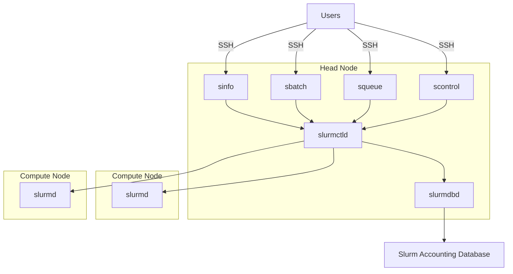
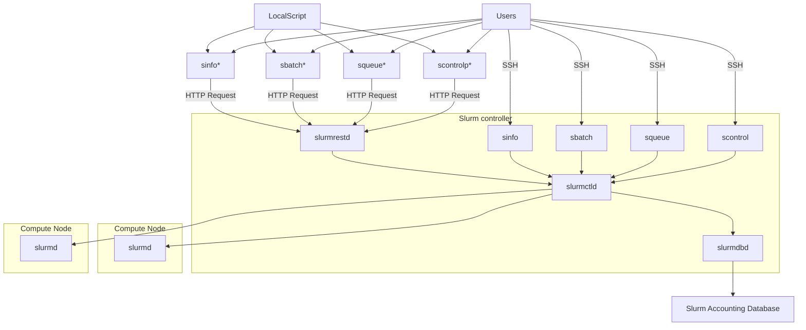

# Developer documentation

!!! warning "Under Development"
    
    This tool is under active development. The documentation is not complete yet. If you have any 
    questions, please contact us via [GitHub Issues](https://github.com/SLURM-CLI-API-Proxy/SLURM-CLI-API-Proxy-client/issues)

## Architectural drivers

- Slurm WLM has a reduced set of commands, but the number of optional arguments required by each one is significantly large
- The OpenAPI specification of slurmrest changes significantly on each new version, as well as the supported arguments by each wlm version.
- A wlm can provide support to multiple OpenAPI specification versions
- Each OpenApi specifaction may significantly differ from each other

Client:

https://github.com/SLURM-CLI-API-Proxy/SLURM-CLI-API-Proxy-client/blob/main/slurm_api_client/docs/SlurmApi.md

### References

- Schmed's [Slurm REST API documentation](https://slurm.schedmd.com/rest_api.html)
- Schmed's [Slurm command line documentation](https://slurm.schedmd.com/sbatch.html)
- [Slurm version vs supported API versions](https://slurm.schedmd.com/upgrades.html#openapi_changes)

