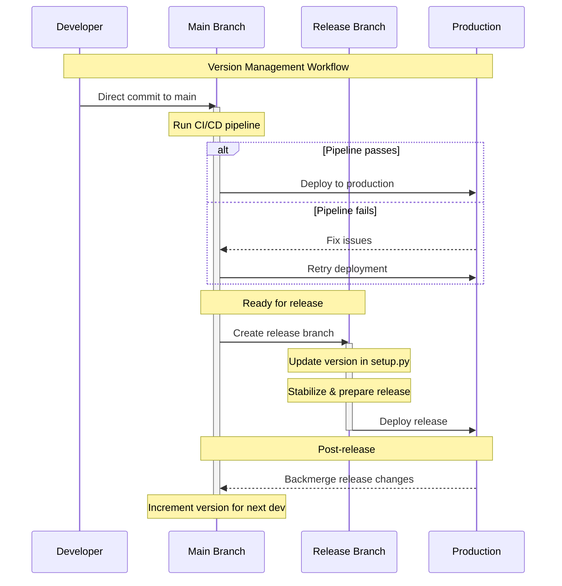

# Continious integration

This repository 

# Version Management

## Overview
This project uses trunk-based development with controlled releases. Versions are managed through a combination of semantic versioning and feature flags.

## Version Update Process
### When to Update Versions
- Update version in setup.py during release branch creation
- Increment version in main branch after release
- Use semantic versioning (major.minor.patch)

### Release Workflow
1. Create release branch from main
2. Update version in setup.py
3. Stabilize and test
4. Deploy to production
5. Merge back to main
6. Increment version for next development cycle

## Main Branch Management
- Keep main branch always releasable
- Use feature flags for incomplete features
- Document version changes in changelog
- Maintain clear version history