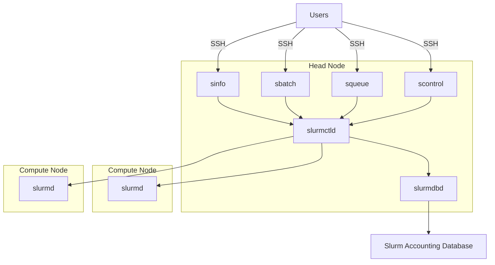
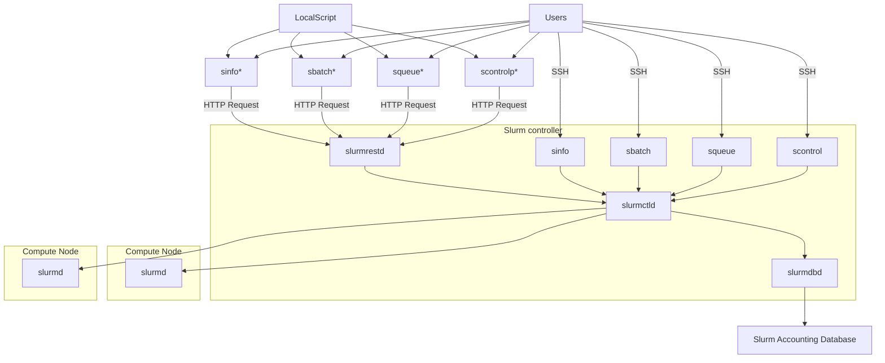

# Command-line interface proxy for SLURM REST API

```mermaid
graph TD;
    
    
    Users -->|SSH| sinfo[sinfo];
    Users -->|SSH| sbatch[sbatch];
    Users -->|SSH| squeue[squeue];
    Users -->|SSH| scontrol[scontrol];
    
    subgraph "Head Node"
        slurmctld --> slurmdbd[slurmdbd];
        sinfo --> slurmctld;
        sbatch --> slurmctld;
        squeue --> slurmctld;
        scontrol --> slurmctld;
    end
    
    subgraph "Compute Node"
        slurmd1[slurmd] 
    end
    
    subgraph "Compute Node"
        slurmd2[slurmd]
    end
    
    slurmctld --> slurmd1;
    slurmctld --> slurmd2;
    
    slurmdbd --> Database["Slurm Accounting Database"];
```

```mermaid
graph TD;
    

    LocalScript --> sinfop
    LocalScript --> sbatchp
    LocalScript --> squeuep
    LocalScript --> scontrolp

    
    Users -->|SSH| sinfo[sinfo];
    Users -->|SSH| sbatch[sbatch];
    Users -->|SSH| squeue[squeue];
    Users -->|SSH| scontrol[scontrol];
    Users --> sinfop
    Users --> sbatchp
    Users --> squeuep
    Users --> scontrolp

    sinfop[sinfo*] --> |HTTP Request| slurmrestd;
    sbatchp[sbatch*] --> |HTTP Request| slurmrestd;
    squeuep[squeue*] --> |HTTP Request| slurmrestd;
    scontrolp[scontrolp*] --> |HTTP Request| slurmrestd;
    

    subgraph "Slurm controller"
        slurmrestd --> slurmctld[slurmctld];
        slurmctld --> slurmdbd[slurmdbd];
        sinfo --> slurmctld;
        sbatch --> slurmctld;
        squeue --> slurmctld;
        scontrol --> slurmctld;
    end
    
    subgraph "Compute Node"
        slurmd1[slurmd] 
    end
    
    subgraph "Compute Node"
        slurmd2[slurmd]
    end
    
    slurmctld --> slurmd1;
    slurmctld --> slurmd2;
    
    slurmdbd --> Database["Slurm Accounting Database"];
```