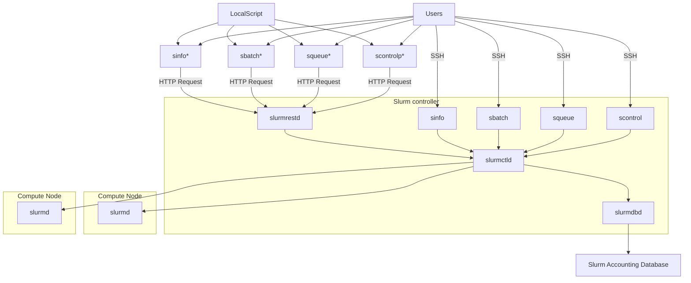

# Command-line interface proxy for SLURM REST API

The SLURM CLI-API Proxy client is a tool designed to bridge existing applications and scripts that rely on the SLURM CLI. The tool mimics traditional SLURM CLI commands (like sbatch and squeue), translating them into REST API calls. This enables seamless integration of existing tools with external SLURM workload managers. Anywhere where a setup assumes the SLURM CLI is available on a host, the SLURM CLI-API Proxy could help offload job processing to a more powerful system.

Examples of use cases for this tool, in the biomedical domain, include the Galaxy Pulsar project, a distributed job execution system that enables Galaxy servers to run computational tasks on remote systems, and Arvados, an open-source platform designed for managing and processing large-scale biomedical data.

For instance, on public HPC Systems like the Dutch Snellius supercomputer, the SLURM CLI is only available on nodes that are not intended for running services like Galaxy Pulsar or Arvados. Hence, enabling these platforms to offload computing tasks to Snellius requires multiple networking/tunneling tweaks, something that is not desirable on an HPC research infrastructure.

While refactoring platforms like Arvados to make it use the SLURM REST API instead of the CLI is an option to address this connectivity challenge, the complexity and scale of its codebase make the SLURM CLI-API Proxy client a more cost-effective solution, as it enables the use of the API without requiring any modifications on the existing codebase.

