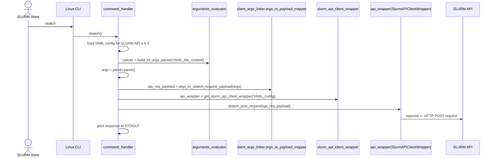

# Extending the SLURM CLI-API Proxy

## CLI-API Proxy design fundamentals

The SLURM-CLI proxy is designed to enable scripts or platforms that depend on SLURM commands to interact with HPC infrastructure, even when those commands are not available locally—such as in cases where the platform cannot be installed within the SLURM cluster. This tool acts as a proxy for SLURM commands by leveraging the SLURM REST API under the hood.

Since each SLURM command can accept dozens or even hundreds of arguments—many of which cannot be replicated through the API and are often unnecessary for these scripts or platforms—this proxy does not aim to provide a complete implementation. Instead, it focuses on a practical subset of arguments that can be extended as needed.

To support this extensibility, the tool is built in a way that it is decoupled from the specificities of each command's arguments, by generalizing how they are mapped to the arguments (payloads) of an API request. This way, adding a new argument only requires adding new values to a configuration file. However, for commands like `squeue` and `sinfo`, whose arguments are not used as the 'payload' but for formatting the command's ouput, the implementation of such formatting is required. 

The requests to the SLURM API are handled through an API client, generated using the [OpenAPI Generator](https://openapi-generator.tech/) using the SLURM OpenAPI specification. The client included on `slurm_api_client` folder corresponds to the API of the SLURM's workload manager release 23.11, whose OpenApi specification is included on the `open_api_specs/slurm_0.0.38_39_40.yaml` folder.


To illustrate the above, let's delve into the process that occurs when the `sbatch` proxy command is executed:

1. The CLI parser (`argparse`) is dynamically configured based on the arguments defined in the `sbatch` command's YAML configuration file (`mappings/sbatch_mappings_r23.11_v0.0.39.yaml`). As the file name suggests, this configuration is tailored to a specific SLURM API version (in this case, v0.0.39, corresponding to SLURM's workload manager release 23.11). For example, the properties defined in the configuration file below enable support for the `--export` and `--job-name` arguments, which are optional (`is_mandatory: false`) and expect string values (`data_type: str`):

    ```yaml
    # mappings/sbatch_mappings_r23.11_v0.0.39.yaml

    - name: --job-name
      abbreviation: -J
      is_mandatory: false
      data_type: str
      api_mapping:
        request_property: job.name

    ```

2. The CLI parser, in addition to check the consistency of the command, capture the values given to these arguments by the user.

3. The captured argument values are used to build the payload required by the POST request (given properties set on the `api_mapping` element) to the correspondig target SLURM API resource (`POST /slurm/v0.0.39/job/submit`). This `api_mapping` must be consistent with the payload that is expected to be submitted with this request. In this case, the API client uses the [V0039JobSubmission](https://github.com/SLURM-CLI-API-Proxy/SLURM-CLI-API-Proxy-client/blob/main/slurm_api_client/docs/V0039JobSubmission.md) class, which in turn has a 'job' property of type [V0039JobDescMsg](https://github.com/SLURM-CLI-API-Proxy/SLURM-CLI-API-Proxy-client/blob/main/slurm_api_client/docs/V0039JobDescMsg.md) with a 'name' property for defining the *job name* of the request. Setting `api_mapping/request_property` to `job.name` for the `--job-name` argument ensure that the value given to the this argument will be set on the corresponding payload property.

    For example, based on the sample configuration above, when running the command:`sbatch script1.sh --job-name job123`, the following JSON payload is generated:

    ```json

    //Payload generated for the command: sbatch script1.sh --job-name job123

    {
        "script": "<the content of script1.sh>",  
        "job": {
            "name": "job123"
        }
    }
    ```

4. The actual request to the SLURM API is performed by a *client wrapper*, which is also defined in the sbatch's command YAML file. This class encapsulates the logic required to perform the request, with a given API client, for a specific API version, using the payload generated from the argument values. As the mappings on the YAML file corresponds to the version v0.0.39 of the API, the (`wrapper_class`) property is also set to use a wrapper implemented for that particular API version.

    ```yaml

    # mappings/sbatch_mappings_r23.11_v0.0.39.yaml

    mapping_meta:
      command: sbatch
      api_version: 0.0.39
      wlm_release: 23.11
      wrapper_package: slurm_api_cli_proxy.client_args_linker.v39.slurm_api_client_wrapper_v39
      wrapper_class: V39SlurmAPIClientWrapper

    ...
    ```

5. Finally, the response to the API request is pre-processed (e.g., handling HTTP error codes, error messages, etc). These results are printed to STDOUT, and the execution is finished with the appropriate error code (e.g., 0 when the command is successful).

The following sequence diagram describes the above with more specific module and classes references:




## Extending already supported commands with new arguments

Given the design principles previously described, adding argument to a command, already configured for a given API version (in this case, v0.0.39) involves the following steps:

1. Check the target API resource used by the command's proxy, its corresponding API client method, and the related data objects. For example, the `sbatch` proxy command currently implemented performs a POST request to `/slurm/v0.0.39/job/submit`.

    | Command  | VERB + Target SLURM API resource    | OpenAPI Client method    | Related data objects | 
    |----------|-------------------------------------|--------------------------|----------------------|
    | sbatch   | POST /slurm/v0.0.39/job/submit     | [slurm_v0039_submit_job](https://github.com/SLURM-CLI-API-Proxy/SLURM-CLI-API-Proxy-client/blob/main/slurm_api_client/docs/SlurmApi.md#slurm_v0039_submit_job) | [V0039JobSubmission](https://github.com/SLURM-CLI-API-Proxy/SLURM-CLI-API-Proxy-client/blob/main/slurm_api_client/docs/V0039JobSubmission.md), [V0039JobDescMsg](https://github.com/SLURM-CLI-API-Proxy/SLURM-CLI-API-Proxy-client/blob/main/slurm_api_client/docs/V0039JobDescMsg.md) (request payload) |
    | squeue   | GET /slurm/v0.0.39/jobs            | [slurm_v0039_get_jobs](https://github.com/SLURM-CLI-API-Proxy/SLURM-CLI-API-Proxy-client/blob/main/slurm_api_client/docs/SlurmApi.md#slurm_v0039_get_jobs) | [V0039JobsResponse](https://github.com/SLURM-CLI-API-Proxy/SLURM-CLI-API-Proxy-client/blob/main/slurm_api_client/docs/V0039JobsResponse.md) (request response) |
    | scontrol | UPDATE /slurm/v0.0.39/job/{job_id} | [slurm_v0039_update_job](https://github.com/SLURM-CLI-API-Proxy/SLURM-CLI-API-Proxy-client/blob/main/slurm_api_client/docs/SlurmApi.md#slurm_v0039_update_job) | [V0039JobDescMsg](https://github.com/SLURM-CLI-API-Proxy/SLURM-CLI-API-Proxy-client/blob/main/slurm_api_client/docs/V0039JobDescMsg.md) (request payload) |
    | sinfo    | GET /slurm/v0.0.39/partitions      | [slurm_v0039_get_partitions](https://github.com/SLURM-CLI-API-Proxy/SLURM-CLI-API-Proxy-client/blob/main/slurm_api_client/docs/SlurmApi.md#slurm_v0039_get_partitions) | [V0039PartitionsResponse](https://github.com/SLURM-CLI-API-Proxy/SLURM-CLI-API-Proxy-client/blob/main/slurm_api_client/docs/V0039PartitionsResponse.md) (request response) |


2. Check which property of the corresponding POST payload should be set to the value given to the argument. To this end, look at the documentation of the class used for creating the request's payload. For example, the POST payload structure required by the `/slurm/v0.0.39/job/submit` resource is defined by the [V0039JobDescMsg](https://github.com/SLURM-CLI-API-Proxy/SLURM-CLI-API-Proxy-client/blob/main/slurm_api_client/docs/V0039JobDescMsg.md) class. 

3. Based on the above, add an entry on the existing YAML configuration file of the `sbatch` command (`mappings/sbatch_mappings_r23.11_v0.0.39.yaml`). For example, to add support to the `--chdir` argument (which defines in which directory within the SLURM worker the script will be executed), you can verify that the its equivalent on the[V0039JobDescMsg](https://github.com/SLURM-CLI-API-Proxy/SLURM-CLI-API-Proxy-client/blob/main/slurm_api_client/docs/V0039JobDescMsg.md) class is the `current_working_directory` property. Based on this, the argument should be included as follows: 

    ```yaml
    - name: --chdir
      abbreviation: -D
      is_mandatory: false
      data_type: str
      api_mapping:
          request_property: job.current_working_directory
    ```

4. And that's it! However, if the captured argument value needs to be pre-processed, you can include a lambda expression to do it if needed. For example, the `--export` argument (the environment variables to be exported), in the `sbatch` command receives a string with comma-separated values, but the [V0039JobDescMsg](https://github.com/SLURM-CLI-API-Proxy/SLURM-CLI-API-Proxy-client/blob/main/slurm_api_client/docs/V0039JobDescMsg.md) class requires a list of strings (that is, each exported environment variable).

    By including the following definition on the `sbatch` YAML configuration file:

    ```yaml
    - name: --export
      abbreviation: --export
      is_mandatory: false
      data_type: str
      api_mapping:
          request_property: job.environment
          lambda_expression: "lambda p: p.split(',')"
    ```

    The following request payload would be generated:

    ```json

    //Payload generated for the command: sbatch script1.sh --export PATH=/bin/,ENV2=123 --job-name job123

    {
        "script": "<the content of script1.sh>",  
        "job": {
            "environment": ["PATH=/bin/","ENV2=123"],
            "name": "job123"
        }
    }
    ```
